# Architecture réseau et Protocoles de communication
## Transmission de données dans un réseau

Le but d'un réseau est de __transmettre des informations d'un ordinateur à un autre__.

Pour cela il faut, dans un premier temps, __décider du type de codage de la donnée à envoyer__, c'est-à-dire sa __représentation informatique__. Celle-ci sera différente selon le type de données (sons, texte, graphique, table, vidéos,...).

La __représentation de ces données__ peut se diviser en deux catégories :

- Une __représentation numérique__ : c'est-à-dire le codage de l'information en un ensemble de valeurs binaires, soit une suite de 0 et de 1.
- Une __représentation analogique__ : c'est-à-dire que la donnée sera représentée par la variation d'une grandeur physique continue, comme une tension.

Les réseaux que nous étudierons ne traitent que de __signaux numériques__.

Les données circulent sur internet sous forme de __datagrammes__. Les datagrammes sont des __données encapsulées__, c'est-à-dire __des données auxquelles on a ajouté des en-têtes__. Ces en-têtes sont des informations nécessaires à leur transport (telles que l'adresse IP de destination).

## Protocoles

Un protocole est une __procédure comprise par les deux machines qui doivent communiquer__.

> __Exemple :__ Lorsque vous rencontrez une personne, nous suivons naturellement un ensemble de protocoles :
- On commence par initier la communication par un bonjour, une poignée de main.
- Ensuite on s'identifie.
- Puis on échange des informations dans un codage adapté (le français).
- On vérifie que l'on s'est compris (oui, ok, j'ai compris).
- Et enfin on se quitte.

En informatique ils existent bon nombre de protocoles : HTTP, IP, TCP, UDP,...

> __Exemple :__ Pour récupérer sur son ordinateur un mail stocké sur un serveur gérant sa mesagerie, on utilise un protocole nommée POP (Post Office Protocol) ou un protocole IMAP (Internet Message Access Protocol).

Un __service__ est une interface (un programme) qui permet de mettre en place un protocole.

# Le modèle TCP/IP, intégré au modèle OSI
## Les 4 couches du modèle TCP/IP

Pour communiquer nous avons besoin de définir des modèles qui constituent des normes de communication. Le __modèle OSI__ est le modèle théorique qui encadre les échanges sur un réseau. Le modèle OSI comporte 7 couches que nous ne détaillerons pas cette année.

Le modèle OSI est un peu complexe et pas forcément ancré dans la réalité. Il a été simplifié pour donner le __modèle TCP/IP, à 4 couches__.

Dans ce modèle par couches, __les données passent d'une couche à l'autre__, sans pouvoir en sauter une. Chaque couche ne peut "communiquer" qu'avec une __couche adjacente__.

TCP/IP désigne communément une architecture réseau, mais cet acronyme désigne en fait deux protocoles étroitement liés : un __protocole de transport, TCP__ (Transmission Control Protocol) qu’on utilise « par-dessus » un __protocole internet, IP__ (Internet Protocol).

Le __modèle TCP/IP est une architecture réseau en 4 couches__ :

- la couche __Application__
- la couche __Transport__
- la couche __Internet__
- la couche __Réseau__

## La couche Application du modèle TCP/IP

La couche Application est la couche la plus haute du modèle TCP/IP à quatre couches. La couche application définit les protocoles d’application TCP/IP et la __manière dont les programmes hôtes se connectent aux services__ de la couche de transport pour utiliser le réseau.

La couche d’application inclut tous les protocoles de niveau supérieur tels que :

- DNS (système de nommage de domaine),
- __HTTP (protocole de transfert hypertexte)__,
- SSH (protocole pour sécuriser la communication grâce à un cryptage),
- FTP (protocole de transfert de fichier),
- SNMP (protocole de gestion de réseau simple) ,
- SMTP (protocole de transfert de courrier simple),
- DHCP (protocole de configuration d’hôte dynamique),
- RDP (protocole de bureau à distance),
- IMAP (protocole pour accéder à ses courriers électroniques),

En première, nous ne nous intéressons qu'au protocole HTTP (revoir le cours sur les interactions Client / Serveur au besoin).

Cette couche fait appel à un ensemble de __services__ pour mettre en place des protocoles (Ex : le __navigateur internet gère le protocole HTTP__).

C'est dans cette __couche Application que les données que l'on veut transmettre sont découpées /organisées pour être envoyées__.

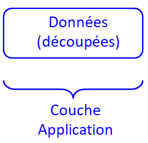

## La couche Transport du modèle TCP/IP

### Le protocole TCP au coeur de la couche Transport

La couche de Transport est la troisième couche du modèle TCP/IP à quatre couches. La couche de Transport a __pour but de permettre aux périphériques des hôtes source et de destination d’engager une conversation__.

Les principaux protocoles inclus dans la couche Transport sont TCP (protocole de contrôle de transmission) et UDP (protocole de datagramme utilisateur).

En première, nous ne nous intéressons qu'au protocole TCP.

Le __protocole TCP__ définit et __organise l'envoi des données__ :

- TCP permet de __remettre en ordre les paquets__ en provenance du protocole IP,
- TCP permet de __vérifier__ le flot de données afin d'éviter une saturation du réseau.
- TCP permet de formater les données en datagramme de longueur variable afin de les "remettre" au protocole IP.
- TCP permet de multiplexer les données, c'est-à-dire de faire circuler simultanément des informations provenant de sources (applications par exemple) distinctes sur une même ligne.
- TCP permet enfin l'initialisation et la fin d'une communication de manière courtoise.

> __Remarque :__ Le protocole UDP encapsule moins d'informations sur le destinataire avec les données si bien qu'aucun accusé de réception n'assure la bonne réception de l'envoi. La fiabilité n'est plus garantie par le protocole UDP mais la mise en oeuvre est plus rapide (pas d'aller-retours). C'est par exemple ce protocole qu'on utilise lors d'un streaming, où la vitesse est plus importante que la fiabilité.

### Le datagramme pour encapsuler les données dans la couche Transport

Un __datagramme est un ensemble de données générées par la couche de Transport TCP__.

Cette couche Transport rajoute des informations aux données à transmettre (dans l'en-tête) pour permettre, entre autre, la reconstitution des données complètes par le receveur une fois tous les paquets reçus. 

Ces données rajoutées forment un __en-tête__. On parle d'__encapsulation__.

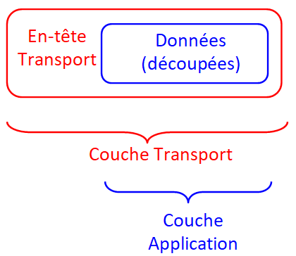

L'ensemble de ces données (en-tête + données découpées de la couche Application) forme le datagramme.

## La couche Internet du modèle TCP/IP

### Le protocole IP au coeur de la couche Internet

La couche Internet est la deuxième couche du modèle TCP/IP à quatre couches. Les couches Internet condensent les datagrammes en __paquets de données__.

Cette couche __gère l'acheminement des datagrammes__ issus de la couche Transport entre une source et un destinataire, en particulier permettant leur __routage à travers différents réseaux__.

Les principaux protocoles inclus dans la couche Internet sont :

- __IP (Internet Protocol)__
- ICMP (Internet Control Message Protocol)
- ARP (Address Resolution Protocol)
- RARP (Reverse Address Resolution Protocol)
- IGMP (Internet Group Management Protocol)

En première, nous ne nous intéressons qu'au protocole IP.

### Le paquet pour encapsuler le datagramme dans la couche Internet

Un __paquet__ est le nom que l'on donne à la __capsule générée par la couche internet IP__.

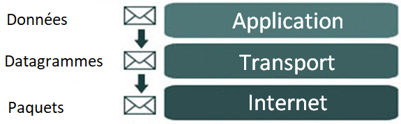

Cette __couche Internet encapsule notamment les datagrammes__ générés par la couche transport TCP __en rajoutant des informations sur les adresses IP source et de destination__ utilisées pour le transfert entre les hôtes et entre les réseaux.

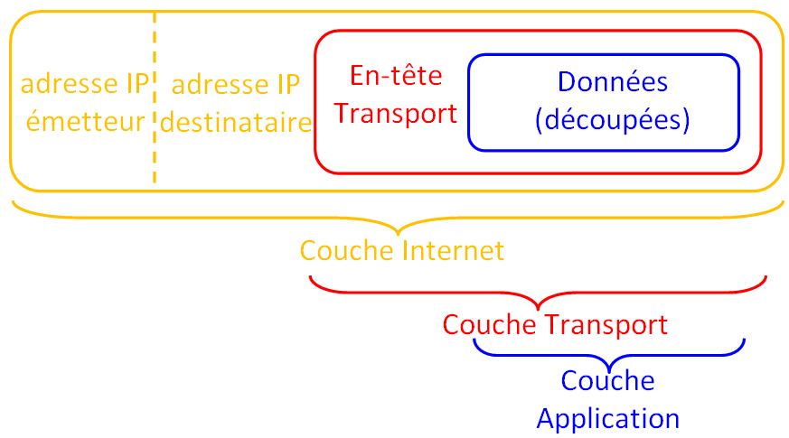

> __Remarques :__ 
- La taille maximale par défaut d'un paquet transmis sur Ethernet est de 1500 octets.
- Sur ces 1500 octets, 40 sont réservés à l'en-tête de la couche Transport.
- Seulement 16 octets sont réservés à l'en-tête de la couche Internet.

## La couche Réseau du modèle TCP/IP

### Le protocole Ethernet au coeur de la couche Réseau

La couche Réseau ou "couche d’accès réseau" ou __"couche matérielle"__ est la première couche du modèle TCP/IP à quatre couches.

La couche d’accès réseau définit en détail comment les __données sont physiquement envoyées__ à travers le réseau, y compris la manière dont les bits sont signalés électriquement ou optiquement par les périphériques matériels qui interfacent directement avec un support réseau, tel qu’un câble coaxial, une fibre optique ou un fil de cuivre à paire torsadée.

Les protocoles inclus dans la couche d’accès au réseau sont :

- __Ethernet__
- Wifi
- Token Ring
- Frame Relay

En première, nous ne nous intéressons qu'au protocole Ethernet.

### La trame pour encapsuler le paquet dans la couche Réseau

Une __trame__ est le nom que l'on donne à la __capsule générée des données gérée par la couche Réseau__.

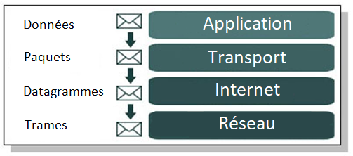

Cette __couche Réseau encapsule notamment les paquets__ générés par la couche Internet. La couche Réseau rajoute aux paquets issus de la courche Internet différentes informations dans une en-tête, dont les __adresses physiques MAC permettant de retrouver la machine destinataire sur le réseau local__.

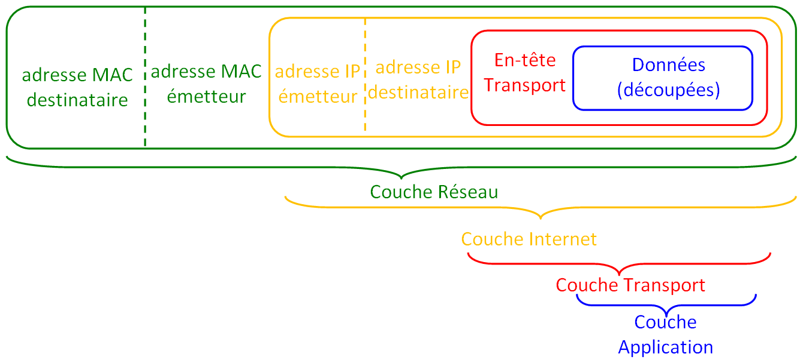

# Encapsulation / Décapsulation
## Principe de l'encapsulation

À l'envoi d'un paquet de données, on parle d'encapsulation :

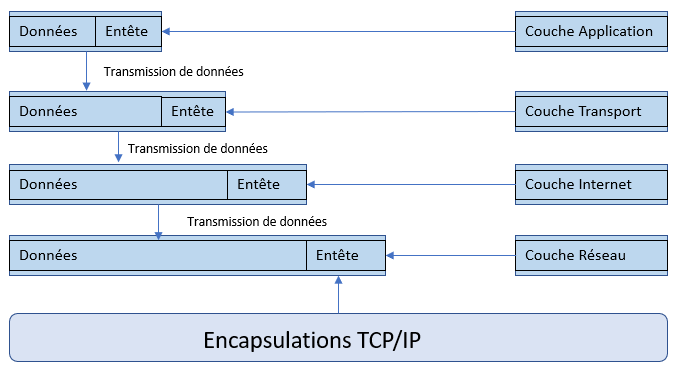

## Principe de la décapsulation

À la réception d'un paquet de données, on parle de décapsulation :

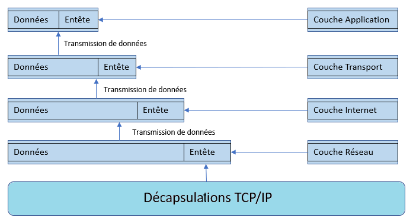

Ces encapsulations et décapsulations sont utilisées pour transférer des données entre deux périphériques sur un réseau.

## Un exemple d'encapsulation / décapsulation

Considérons un ordinateur dont le navigateur veut accéder au contenu d'une page Web stocké dans un serveur distant. Pour cela, le __navigateur du client va envoyer une requête HTTP au serveur__. Une telle requête est un message. 

Pour simplifier l'exemple, on suppose que :

- le navigateur connaît l'IP du serveur : le protocole DNS (Domain Name System) n'est pas utilisé.
- l'acheminement de l'ordinateur client au serveur se fait en passant uniquement par deux routeurs : routeur 1 et routeur 2.

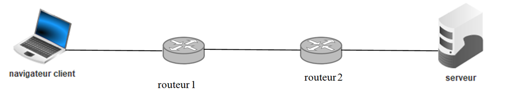

Les données de la requête vont suivre les modifications et cheminement suivant :

### 1. Au niveau de l'ordinateur client, il y a une encapsulation.

  - Le navigateur prépare la __requête HTTP__ : couche Application.
  - Cette requête est encapsulée dans un __datagramme__ (ou plusieurs) par le protocole TCP : couche Transport.
  - Ces datagrammes sont encapsulés avec des adresses IP dans des __paquets__ pour pouvoir circuler dans le réseau : couche Internet.
  - Ces paquets sont encapsulés avec des adresses physiques MAC dans des __trames__ : couche Réseau.

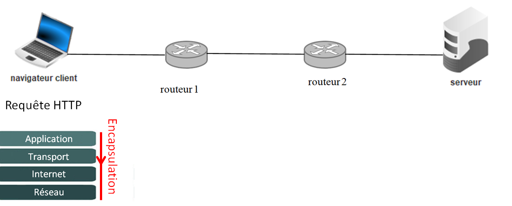

Une fois encapsulée dans une trame, le tout peut circuler et être orienté dans les réseaux.
La trame est transmise, par une succession de bits, au routeur 1.

### 2. Au niveau du routeur 1

  - Décapsulation pour lire une partie du contenu des en-têtes : lorsque la trame arrive au routeur 1, celui-ci a besoin de connaître l'expéditeur et le destinataire. Pour cela, il va décapsuler :

    - les trames pour récupérer les adresses physiques MAC,
    - les paquets pour récupérer les adresses logiques IP.

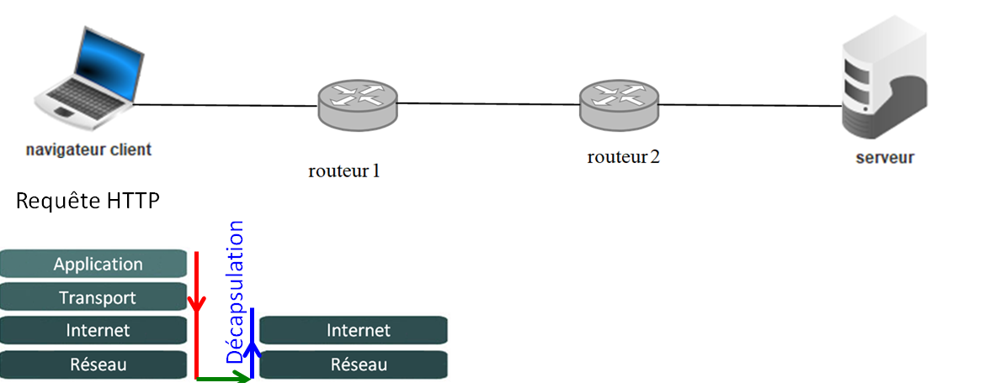

Avec ces adresses (et sa table de routage, à voir en classe de Terminale), le routeur va pouvoir acheminer les données à l'intermédiaire suivant : le routeur 2.

Cependant, pour pouvoir être renvoyées sur le réseau, les données doivent être encapsulées sous forme d'une trame. D'où :

  - encapsulation pour le renvoi sur le réseau : comme il y a eu deux niveaux de décapsulation, il faut encapsuler deux fois pour transformer les données en paquet puis trame.

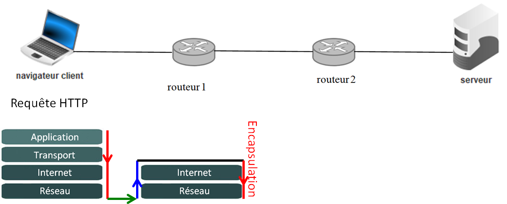

Le routeur 1 envoie la trame vers le routeur 2.

### 3. Au niveau du routeur R2

Le même besoin des adresse MAC et IP conduit au même travail de décapsulation et d'encapsulation avant que ce routeur n'envoie la trame réencapsulée vers le serveur destinataire.

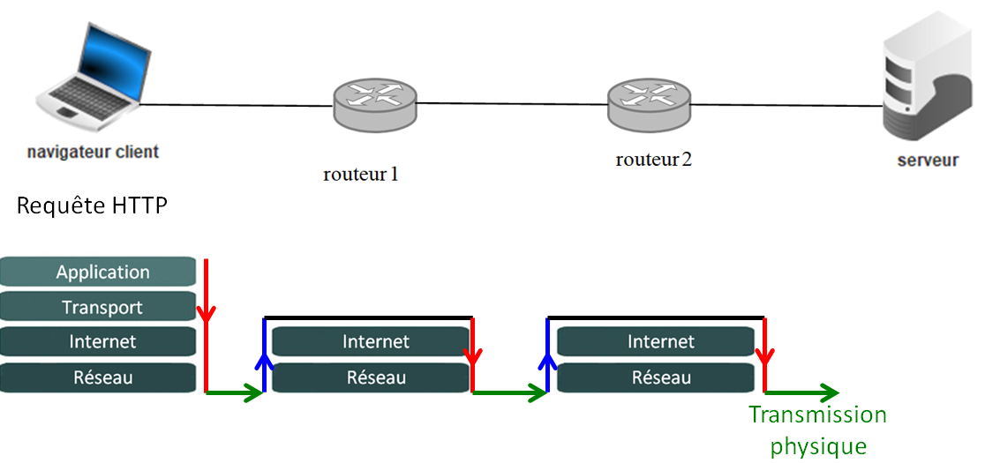

### 4. Au niveau du serveur

Le serveur doit récupérer la requête HTTP qu'il vient de recevoir encapsulée dans une trame.
Pour cela, il doit enlever les différentes en-têtes en décapsulant :

- d'abord la trame pour extraire le paquet IP.
- ensuite le paquet IP pour extraire le datagramme.
- enfin le datagramme pour extraire les données correspondant à la requête HTTP.

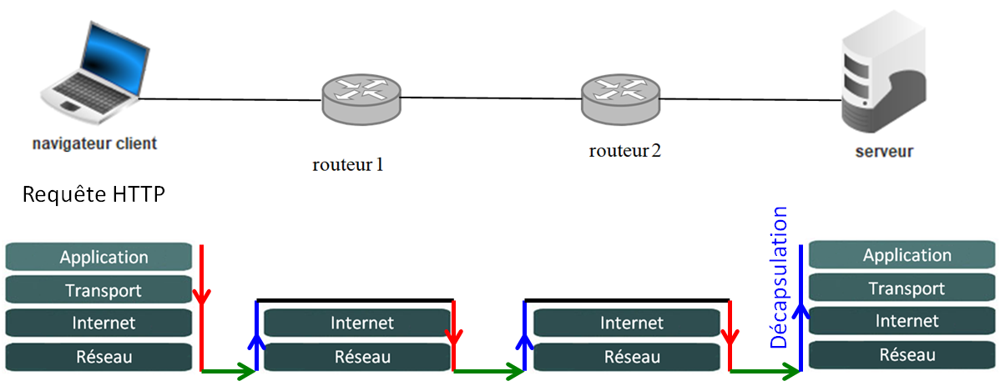

Une fois la requête HTTP reçue et extraite, le serveur peut traiter la demande.

Sa réponse contenant le code de la page Web suivra lui aussi une succession d'encapsulations et de décapsulations à travers son acheminement sur le réseau.

# Le modèle TCP/IP schématisé

On présente en général le modèle TCP/IP de haut en bas comme dans l'illustration ci-dessous contenant différents noms de protocoles :

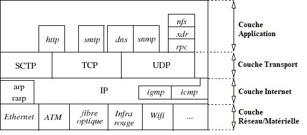

---

Auteur : David Landry, Lycée Clemenceau - Nantes

D'après des documents partagés par...

<a  href=http://www.monlyceenumerique.fr/index_nsi.html#premiere>JC. Gérard, T. Lourdet, J. Monteillet, P. Thérèse, sur le site monlyceenumerique.fr</a>
